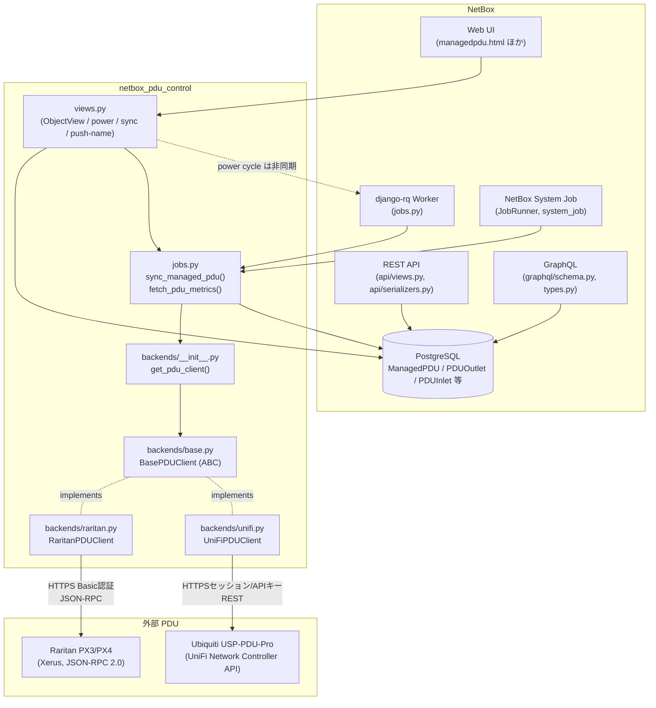
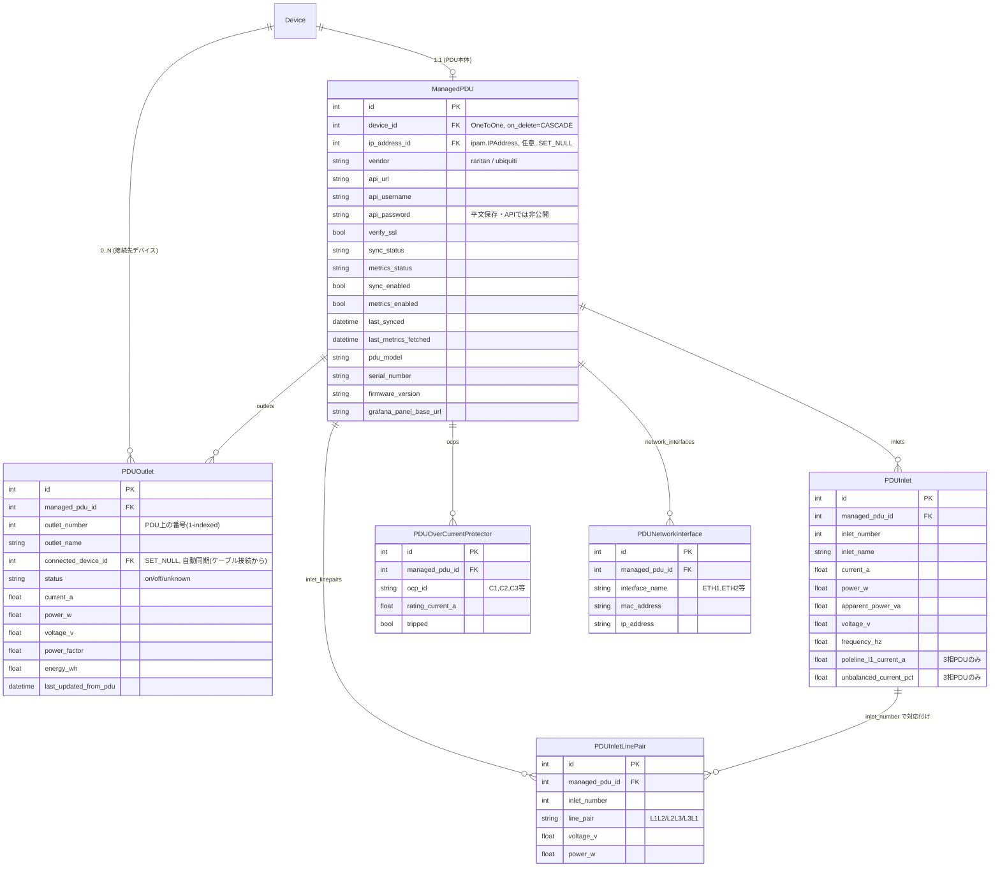
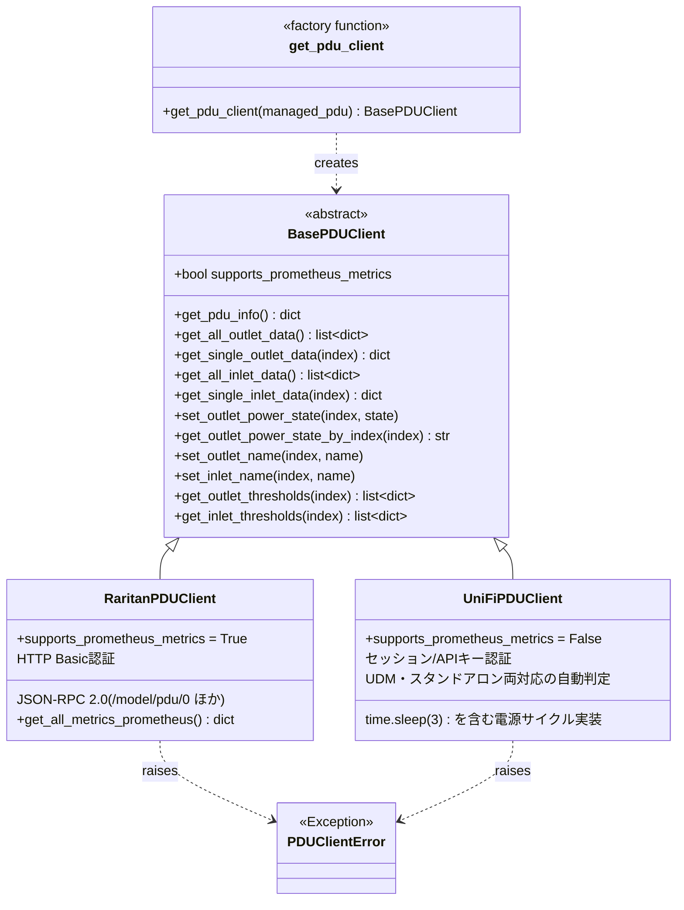
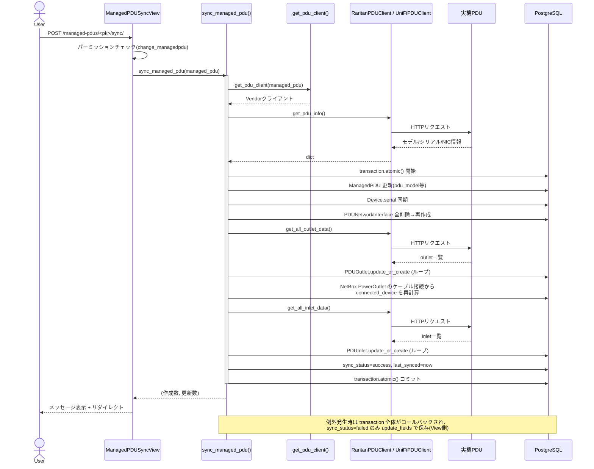
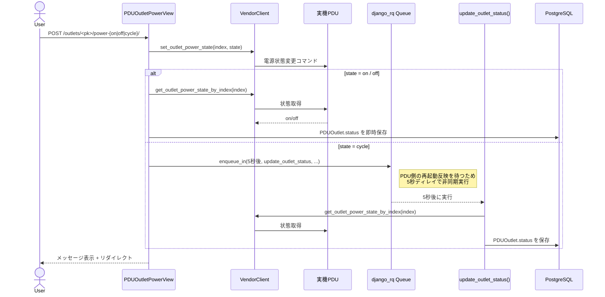
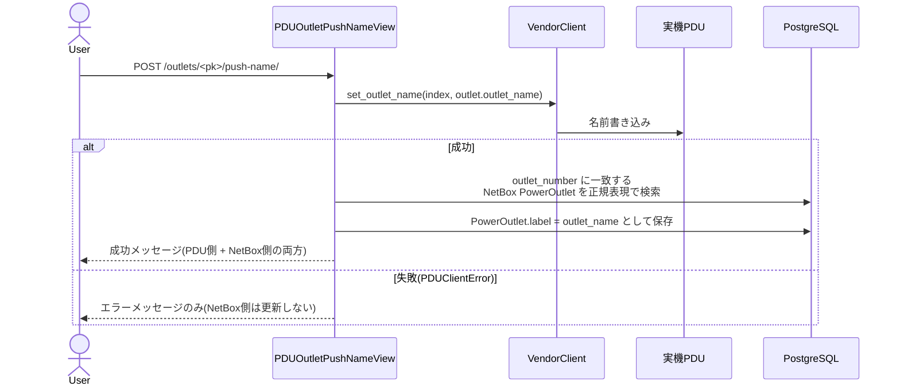
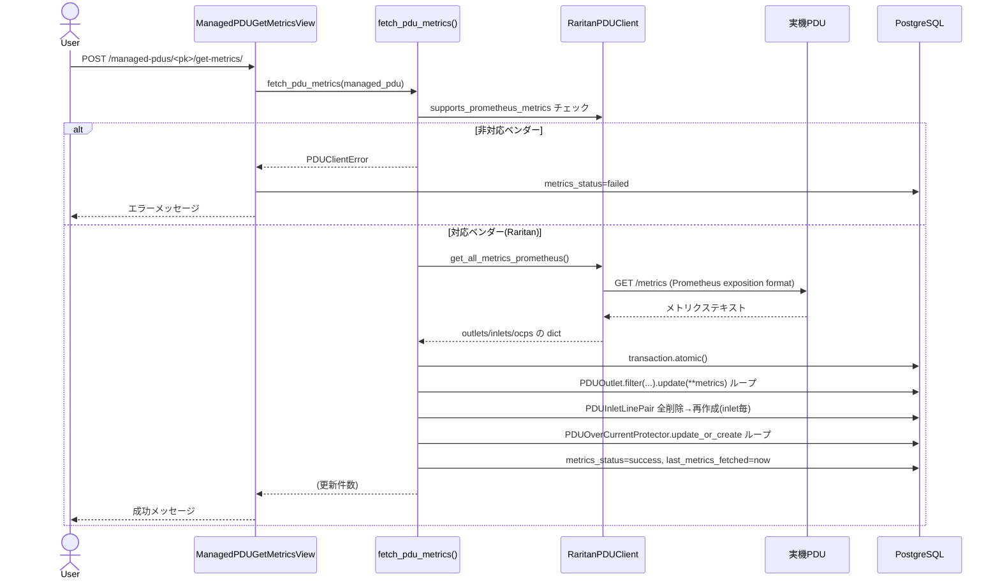
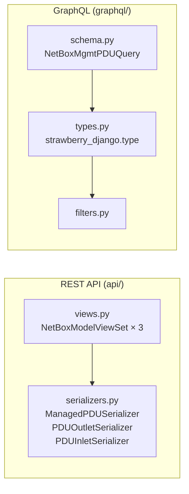

# 詳細設計書

本ドキュメントは NetBox PDU Control プラグインの内部設計をまとめたものです。コード変更時の参照用として、アーキテクチャ・データモデル・主要な処理フローを図とともに解説します。

対象読者: 本プラグインの開発・保守を行うエンジニア。

---

## 1. 概要

NetBox PDU Control は、NetBox に登録された `Device`(PDU 本体)に対して、ベンダー各社の管理 API 経由でアウトレット/インレットの状態取得・電源制御・名前同期を行う NetBox プラグインです。

- 対応ベンダー: Raritan(JSON-RPC 2.0)、Ubiquiti UniFi USP-PDU-Pro(REST API)
- ベンダー差異は `backends/` 配下の抽象化レイヤーに閉じ込め、View 層・同期ロジックはベンダー非依存
- NetBox 標準の generic view / DRF / GraphQL(strawberry-django)パターンに準拠

---

## 2. 全体アーキテクチャ

**ポイント**

- `views.py` は `get_pdu_client()` 経由でのみベンダー API にアクセスし、ベンダー固有コードを持たない([CLAUDE.md](../CLAUDE.md) の規約通り)。
- 電源サイクル(Power Cycle)のみ `django_rq` でバックグラウンドジョブ化し、5 秒後に状態を再取得する(PDU 側の反映ラグを吸収)。
- 定期実行(`PDUSyncJob` / `PDUGetMetricsJob`)は NetBox 標準の `system_job` デコレータで登録され、`PLUGINS_CONFIG` の `sync_poll_interval` / `metrics_poll_interval` が 0 より大きい場合のみ有効化される。
- `get_pdu_client()` は認証情報を直接 `ManagedPDU` から読まず、`credentials.get_credential()` 経由で解決する(netbox-secrets 優先・平文フォールバック、詳細は[§9](#9-セキュリティ上の考慮事項))。

---

## 3. データモデル(ER 図)

**モデルごとの更新方針**(`CLAUDE.md` にも明記されている重要な差異):

| モデル | 更新方針 | 理由 |
|---|---|---|
| `PDUOutlet` / `PDUInlet` | `update_or_create`(存在すれば更新、なければ作成) | outlet/inlet 番号は基本的に不変 |
| `PDUInletLinePair` / `PDUNetworkInterface` | 全削除→再作成 | 3相/NIC構成が変わりうるため差分管理せず単純化 |
| `PDUOverCurrentProtector` | `update_or_create` | OCP 数は固定だが取得元がメトリクスAPIのみ |
| `PDUOutlet.connected_device` | NetBox の `PowerOutlet` ケーブル接続から自動導出 | 手動フィールドだが sync 時に上書きされる(下記シーケンス参照) |

---

## 4. ベンダーバックエンド抽象化

新しいベンダーを追加する手順(`backends/base.py` docstring より):

1. `backends/<vendor>.py` に `BasePDUClient` を実装したクラスを作成
2. `backends/__init__.py` の `_VENDOR_BACKENDS` に登録
3. `choices.VendorChoices` にベンダーを追加
4. マイグレーション作成

---

## 5. 主要シーケンス

### 5.1 PDU フルシンク(`ManagedPDUSyncView`)

### 5.2 アウトレット電源制御(ON/OFF は同期、Cycle は非同期)

### 5.3 名前プッシュ(NetBox → PDU、双方向ラベル同期)

### 5.4 メトリクス取得(Prometheus 対応ベンダーのみ)

---

## 6. バックグラウンド処理・定期実行

| 種別 | 起動元 | 実装 | 用途 |
|---|---|---|---|
| RQワーカー(即時 enqueue) | `PDUOutletPowerView`(cycle時のみ) | `jobs.update_outlet_status()` | 電源サイクル5秒後の状態再取得 |
| NetBox System Job | `settings.PLUGINS_CONFIG["netbox_pdu_control"]["sync_poll_interval"]` > 0 | `jobs.PDUSyncJob`(`system_job(interval=...)`) | `sync_enabled=True` の全PDUを定期フルシンク |
| NetBox System Job | 同上 `metrics_poll_interval` | `jobs.PDUGetMetricsJob` | `metrics_enabled=True` の全PDUを定期メトリクス取得 |

いずれも1台の失敗が全体を止めないよう `try/except` でPDUごとに独立して処理し、失敗PDUのみ `sync_status`/`metrics_status` を `failed` に更新する。

---

## 7. REST API / GraphQL

- REST API: NetBox標準の `NetBoxModelViewSet` + `NetBoxModelSerializer` パターン。`ManagedPDUSerializer.api_password` は `write_only=True` — **書き込みは可能だがレスポンスには一切出力されない**(平文保存フィールドの漏洩防止)。
- GraphQL: strawberry-django ベース。`enums.py` が `choices.py` の選択肢をGraphQL Enumとしてミラーリング。

---

## 8. URL構成(`urls.py`)

NetBox標準の `get_model_urls()` によるCRUD URL(一覧・詳細・作成・編集・削除)に加え、以下の非CRUDエンドポイントを個別定義:

- `managed-pdus/<pk>/sync/` — フルシンク
- `managed-pdus/<pk>/get-metrics/` — メトリクス取得
- `managed-pdus/<pk>/bulk-power/` — 複数アウトレット一括電源制御
- `managed-pdus/test-connection/`(pkなし)— Add/Edit フォームの入力値(未保存)で接続テスト
- `outlets/<pk>/{sync,power-on,power-off,power-cycle,push-name}/`
- `inlets/<pk>/{sync,push-name}/`

**Add/Edit フォームの接続テスト・IP自動入力:** `ManagedPDUEditView` は `template_name` を
`netbox_pdu_control/managedpdu_edit.html` に明示的に上書きしている(NetBoxの generic
`ObjectEditView` は `<app>/<model>_edit.html` を自動探索しないため、`netbox-bmc` と同様に
明示指定が必要)。このテンプレートで:
- **Test Connection** ボタン: フォームの vendor/api_url/api_username/api_password/verify_ssl を
  `ManagedPDUConnectionTestView` に fetch で POST し、保存前に接続確認する(DBには一切書き込まない)
- **IP Address** ピッカー(`ip_address` フィールド、`query_params={"device_id": "$device"}` で
  選択中の Device に紐づくIPのみ表示): 選択すると JS が `/api/ipam/ip-addresses/<id>/` を
  fetch し、`api_url` フィールドに `https://<ip>` を自動入力する(`ip_address` 自体はDBに
  保存されるが、実際の接続には `api_url` の値のみが使われる)

---

## 9. セキュリティ上の考慮事項

- 認証情報は `credentials.py` の `get_credential()` が解決する。優先順位は次の通り(`netbox-bmc` プラグインの方式を踏襲):
  1. **netbox-secrets**(導入済みの場合)— role `pdu-credentials` を持ち Device に紐づけられた `Secret`。`Secret.name`=ユーザー名、`Secret.plaintext`=パスワード(RSA暗号化)。Web View 経由ならリクエストのセッションキーで、バックグラウンドジョブ(system job / RQ)なら `PLUGINS_CONFIG["netbox_pdu_control"]["service_account"]` のサービスアカウント秘密鍵で復号する。
  2. **平文フォールバック** — netbox-secrets 未導入・該当Secretなし・復号失敗時は `ManagedPDU.api_username`/`api_password` にフォールバックする。
  復号に失敗した場合はエラーログを残した上でフォールバックする(無音でのフォールバックは運用上気付きにくいため)。
- `get_pdu_client(managed_pdu, request=None)` は `request` を `get_credential()` に転送する。View 層からは常に `request` を渡し、System Job/RQ ジョブからは `request=None`(サービスアカウント経路)で呼び出す。
- `ManagedPDU.api_password`(フォールバックフィールド)は **平文で DB に保存**される(NetBox標準の暗号化フィールドは未使用)。
- REST APIシリアライザ・ログ出力のいずれにも `api_password` を含めないこと(`CLAUDE.md` にも明記された規約)。
- 電源サイクル用のRQジョブ(`jobs.update_outlet_status`)は、以前は `managed_pdu.api_password` を平文でジョブ引数としてRedisに渡していたが、実装はその引数を使わず `outlet.managed_pdu` から再取得していたため、この不要な平文受け渡しは削除済み。
- 全ての制御系View(sync / power / push-name)は `request.user.has_perm("netbox_pdu_control.change_managedpdu")` を個別にチェックしてから処理する。
- `verify_ssl=False` の場合、両バックエンドで `urllib3.disable_warnings(InsecureRequestWarning)` を呼び出し、自己署名証明書運用時の警告ログ氾濫を抑止(意図的な設計)。

---

## 10. 関連ドキュメント

- [README](../README.md) — インストール手順、対応ハードウェア、設定例
- [CONTRIBUTING](../CONTRIBUTING.md) — 開発フロー、リリース手順
- [COMPATIBILITY](../COMPATIBILITY.md) — NetBoxバージョン互換表
- [CHANGELOG](../CHANGELOG.md) — バージョンごとの変更履歴
